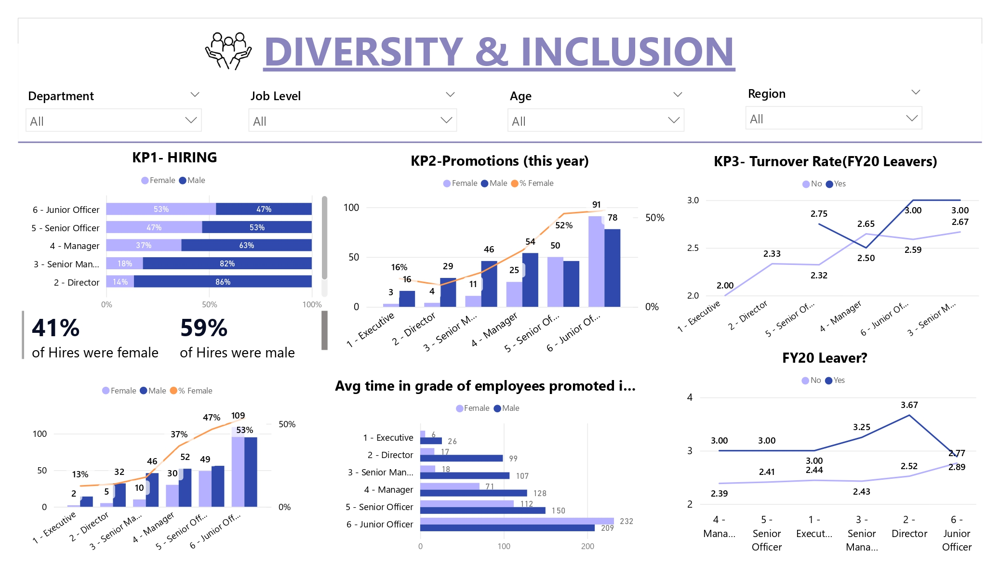
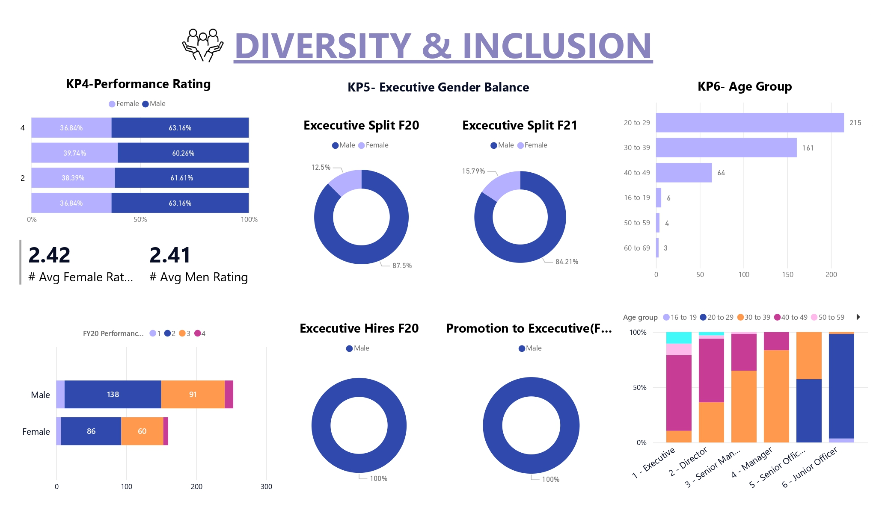

# 📊 Diversity & Inclusion (D&I) Workforce Analysis Dashboard  

## 📌 Project Overview  
This project involved developing a comprehensive **Diversity and Inclusion dashboard** to analyze workforce dynamics across the employee lifecycle: **Hiring, Promotions, Performance, and Retention**.  

The analysis provides **HR and Executive leadership** with critical, data-driven insights necessary for monitoring strategic D&I goals and informing policy changes.  

- **Tool Used:** Microsoft Power BI  
- **Dataset:** Workforce dataset provided by PwC (Forage Virtual Internship)  

 

## 🎯 Key Objectives  
- **Analyze Workforce Distribution:** Assess gender and age balance across all job levels.  
- **Identify Disparities:** Uncover gender gaps in Hiring, Promotion Rates, and Turnover by job level.  
- **Evaluate Executive Balance:** Track Executive Gender Balance and measure effectiveness of D&I initiatives.  
- **Provide Actionable Insights:** Highlight structural inequities to drive policy change and inclusivity.  

 

## 🔍 Exploratory Data Analysis (EDA) & Key Findings  

### ⚖️ Performance vs. Promotion Disparity (KP2 & KP4)  
- **Performance Parity:** Average ratings are nearly identical → **Female: 2.42 vs. Male: 2.41**.  
- **Promotion Bottleneck:** Despite equal performance, only **18% of promotions to Senior Manager** were Female vs. 82% Male.  
- **Executive Ceiling:** In the analyzed period (F20), **100% of Executive Hires & Promotions were Male**, showing a structural barrier for women.  

### 💼 Executive Representation & Trends (KP5)  
- **Gender Balance:** Executive female representation improved slightly from **12.5% (F20) → 15.79% (F21)**.  
- **Pipeline Issue:** Lack of female promotions/hiring into executive roles is the primary cause of imbalance.  

### 📉 Hiring and Retention (KP1 & KP3)  
- **Overall Hiring:** **41% Female vs. 59% Male**.  
- **Hiring Gaps:** Female hires underrepresented at **Director (14% Female)** and **Manager (37% Female)** roles.  
- **Turnover Risk:** Highest turnover in **Senior Director (3.67)** and **Executive (3.25)** levels, posing retention risks at critical positions.  

 

## 🏆 Recommendations  

- **Promotion Process Audit:**  
  Review promotion criteria, as equal performance does not translate into equal promotions.  

- **Executive Pipeline Strategy:**  
  - Mandate diverse candidate slates for Executive Hires/Promotions.  
  - Launch sponsorship & mentorship programs for high-performing women.  

- **Targeted Retention Programs:**  
  Develop engagement/retention initiatives for Senior Directors & Executives.  

- **Hiring Equity:**  
  Set measurable targets to increase female hires in **Manager** and **Director** roles.  

 

## 🖼️ Dashboard Visualization  

  
 

## 📂 How to Use This Repository

- The **Power BI dashboard** is available in the repository (`.pbix` file or PDF export).  
- Clone or download the repo to explore the report.  
- Open the dashboard in **Power BI Desktop** or view the exported PDF for insights.  
